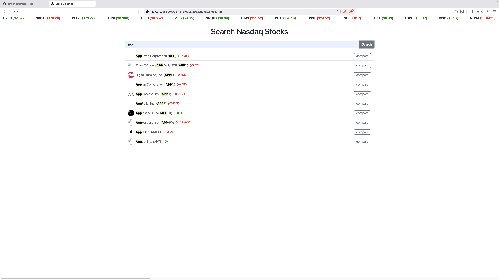
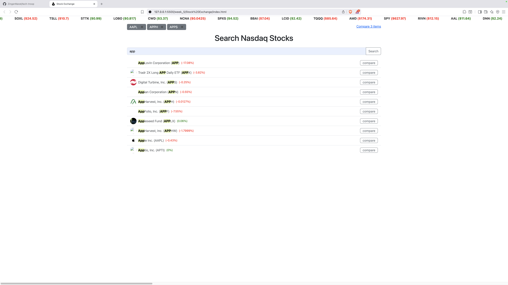
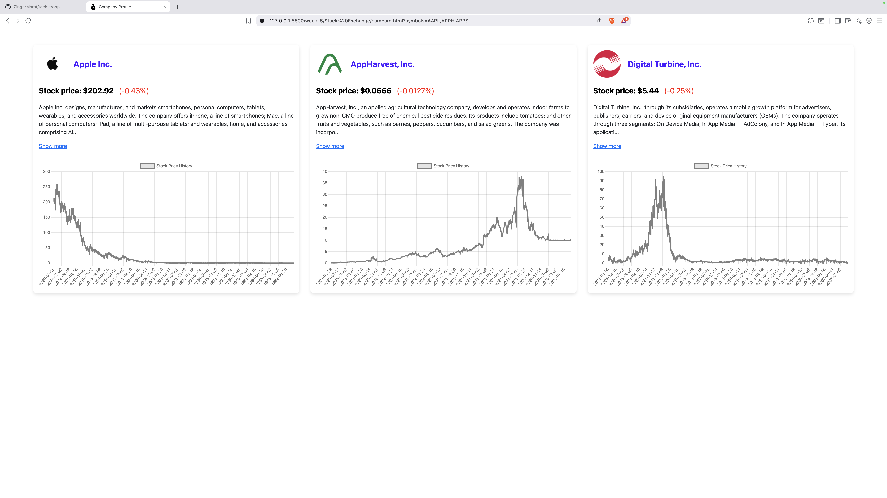

# 📈 Stock Exchange App

A multi-page stock exchange web application built using vanilla JavaScript, HTML, CSS, and the [Financial Modeling Prep API](https://financialmodelingprep.com/developer/docs/).  
The app allows users to search for companies, view detailed financial data, compare stocks, and see real-time stock updates in a dynamic marquee.

<p align="center">
  
  
  
</p>

## 🚀 Features

- 🔍 **Company Search** – Search NASDAQ-listed companies by name or symbol.
- 📄 **Company Profile Page** – View company image, description, current stock price and percentage change.
- 📊 **Historical Chart** – Visualize historical stock prices with [Chart.js](https://www.chartjs.org/).
- 🧠 **Debounced Auto Search** – Get search results while typing (with performance optimization).
- 💹 **Stock Marquee** – Real-time scrolling stock prices, just like in the stock market.
- 🧱 **Modular Architecture** – App functionality split into reusable JavaScript classes.
- 🔀 **Compare Stocks** – Add companies to a comparison list and view them side-by-side.
- 🎨 **Custom Design** – No external design templates used. Fully styled from scratch.

## 📂 Project Structure

```bash
📁 /project-root
│
├── 📄 index.html            # Main page for searching stocks
├── 📄 company.html          # Displays company info and chart
├── 📄 compare.html          # Compare selected companies
│
├── 📄 Marquee.js            # JS class for stock marquee
├── 📄 SearchForm.js         # JS class for search form
├── 📄 SearchResult.js       # JS class for search results
├── 📄 CompanyInfo.js        # JS class for company data page
├── 📄 CompareList.js        # JS class for managing comparison list
│
├── 📁 /assets               # CSS, images, favicon, etc.
└── 📄 README.md
```

## 🛠️ Tech Stack

- HTML, CSS (vanilla)
- JavaScript (ES6+)
- [Chart.js](https://www.chartjs.org/)
- [Financial Modeling Prep API](https://financialmodelingprep.com/developer/docs/)

## 📌 Setup Instructions

1. Clone the repo:

```bash
git clone https://github.com/yourusername/stock-exchange.git
cd stock-exchange
```

2. Get your **API key** from [Financial Modeling Prep](https://financialmodelingprep.com/).
3. Add your API key in your JavaScript fetch calls (e.g., `&apikey=YOUR_API_KEY`).
4. Open `index.html` in your browser to start using the app.

## ⚠️ Notes

- **API Limit**: 250 requests/day – plan your testing accordingly.
- You can mock API responses during development to avoid hitting the limit.
- This project uses URL query parameters to pass data between pages (`company.html?symbol=...`).

## 👨‍💻 Author

**Marat Zinger**  
📧 zingermarat@gmail.com  
💻 [GitHub](https://github.com/ZingerMarat)